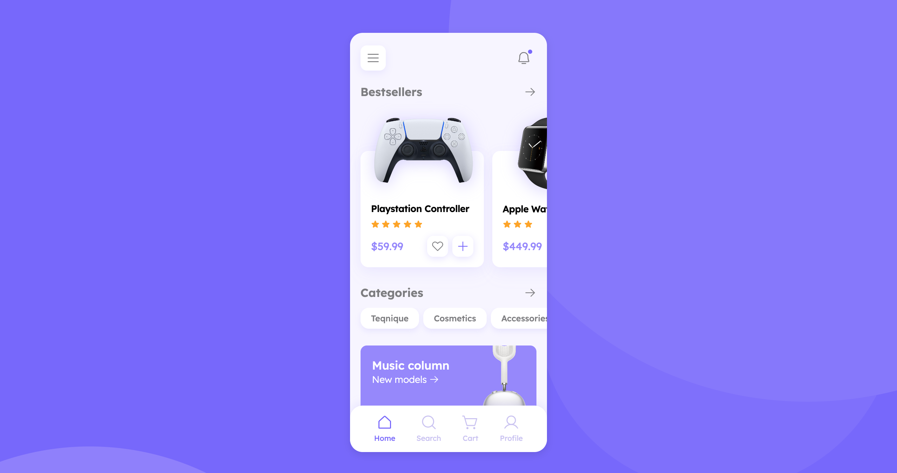

# Electronic Store App

## Overview

The Electronic Store App is a responsive web application that provides a user-friendly shopping experience for various electronic products, including smartphones and laptops. Built with HTML and CSS, the app allows users to effortlessly browse, filter, and purchase their favorite electronics.

## Features

- **Responsive Design:** Works seamlessly on desktops, tablets, and smartphones.
- **Intuitive Navigation:** Easy access to product categories and search functionality.
- **Product Filtering:** Filter products by brand, price, and specifications.
- **Product Listings:** High-quality images, detailed descriptions, and customer ratings.
- **Shopping Cart:** Add products and proceed to checkout smoothly.

## Technologies Used

- HTML
- CSS
